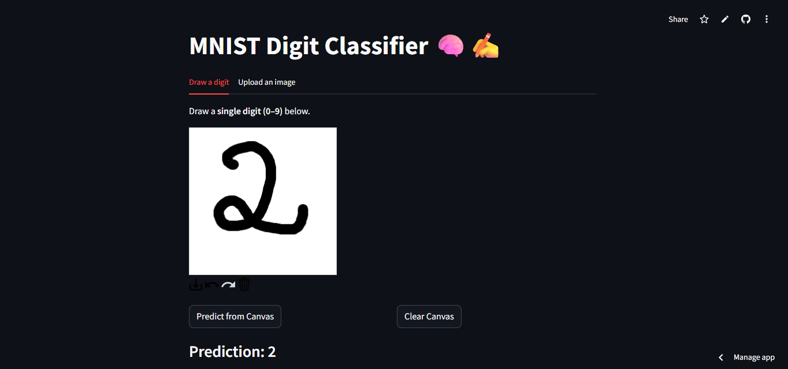
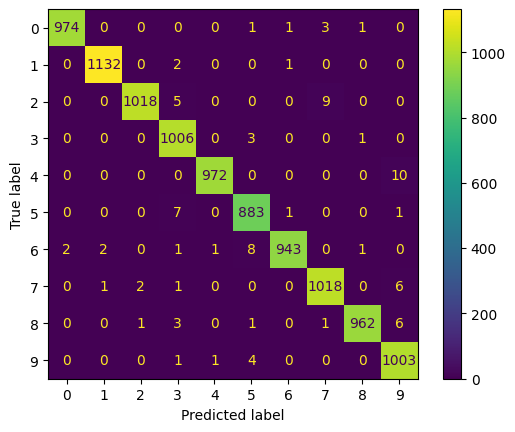
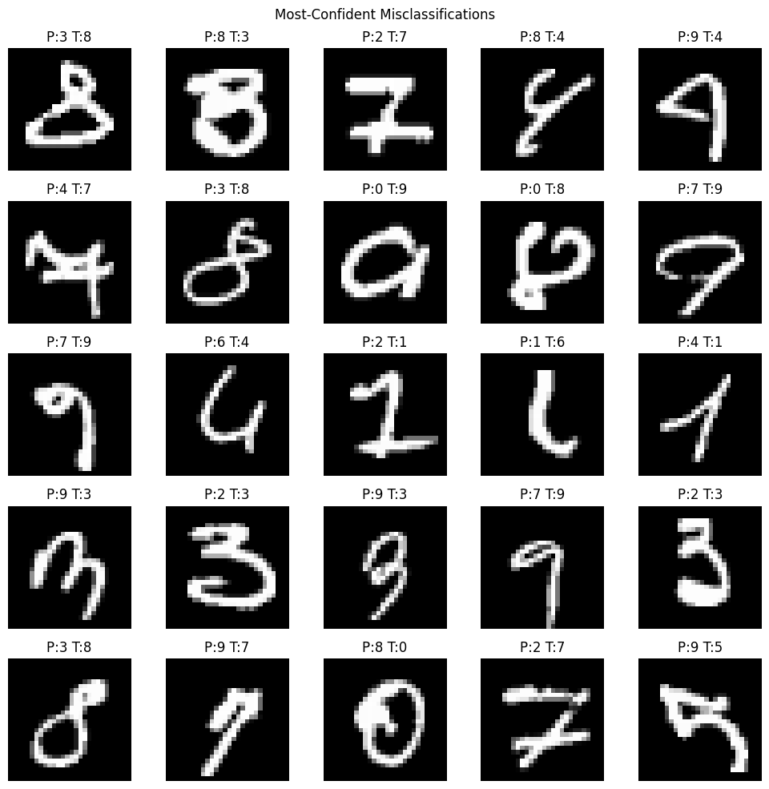
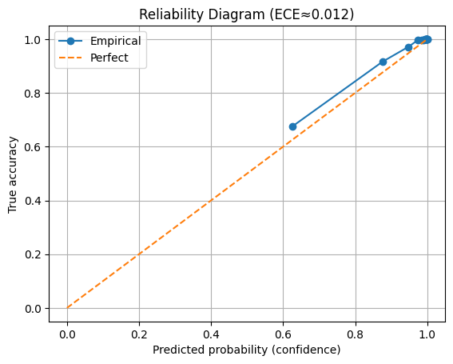

# MNIST Digit Classifier 🧠✍️  
Classify hand-drawn digits (0–9) using a TensorFlow/Keras CNN — with a **Streamlit app** where you can draw or upload a digit.


👉 [**Live Demo (Streamlit)**](https://ai-mnist-tf-noella-buti.streamlit.app)



---

## ✨ Overview
This project trains a compact CNN on **MNIST** and serves an interactive **Streamlit** UI to draw/upload digits.  
It includes preprocessing (invert → crop → center → resize), saved artifacts, and basic evaluation reports.

---

## 🔍 Features
- CNN with TensorFlow/Keras (small, fast inference)
- Preprocessing pipeline to MNIST format
- Draw or upload image in the browser (Streamlit)
- Metrics + confusion matrix artifacts

---

## 🚦 Quickstart

### Train (local)
```bash
python notebooks/train_mnist_cnn.py
```

Run the app
```bash
streamlit run app/app.py
```

(Optional) Tests
```bash
pytest -q
```

## 📁 Repository Layout
```bash
ai-mnist-tf/
├─ app/            # Streamlit app
├─ artifacts/      # saved model (e.g., model.h5 / .keras)
├─ reports/        # metrics, plots, confusion matrix
├─ notebooks/      # training notebook(s)
├─ docs/           # mnist_app_demo.png
├─ requirements.txt
└─ README.md
```

## 📊 Results (Held-Out Test Set)
```md
| Metric    |   Value   |
|-----------|----------:|
| Accuracy  | 97.64%    |
| Correct   | 9,764     |
| Incorrect | 236       |
| Loss      | —         |
```

## 📷 Visuals






## 🔮 Roadmap
- Add ONNX/TFLite export for mobile
- Add doodle pad smoothing & threshold knob
- Batch upload evaluation page

## 📜 License
MIT (see LICENSE)

---
