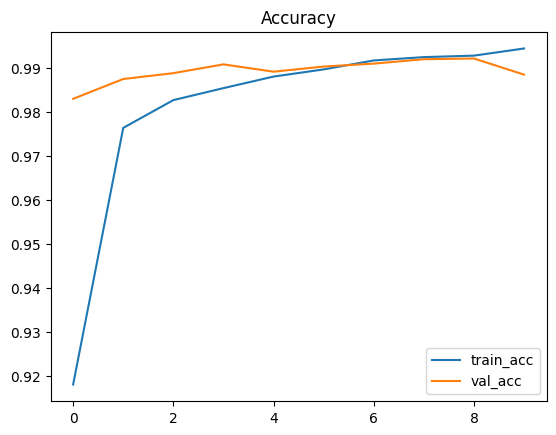

# MNIST Digit Classifier 🧠✍️  
Classify hand-drawn digits (0–9) with a TensorFlow/Keras **CNN** — plus a **Streamlit app** to draw or upload a digit.

 
 
 
 


👉 [**Live Demo (Streamlit)**](https://ai-mnist-tf-noella-buti.streamlit.app/)  


---

## ✨ Overview
A compact CNN trained on **MNIST** with clean, reproducible artifacts (saved model, metrics, and plots).  
The Streamlit UI includes preprocessing (invert → crop → center → resize to 28×28) so hand-drawn inputs match MNIST formatting.

---

## 🔍 Features
- TensorFlow/Keras **CNN**:
  - Conv(32,3) → ReLU → MaxPool  
  - Conv(64,3) → ReLU → MaxPool  
  - Flatten → Dense(128) → Dropout(0.3) → Dense(10, softmax)
- Training: `epochs=10`, `batch_size=128`, `val_split=0.1`
- Saved artifacts: **model**, **metrics**, **plots**
- Streamlit app: draw/upload a digit and get a prediction

---

## 🚦 Quickstart

### Train (Notebook)
```bash
jupyter notebook notebooks/train_mnist.ipynb
```

Saves:
- Model → artifacts/mnist_cnn.keras
- Metrics → reports/metrics.json
- Plots → reports/acc_loss.png, reports/confusion_matrix.png

Run the App
```bash
streamlit run app/app.py
```

## 📁 Repository Layout
```bash
ai-mnist-tf/
├─ app/                 # Streamlit app
├─ artifacts/           # saved model (mnist_cnn.keras)
├─ reports/             # metrics.json, acc_loss.png, confusion_matrix.png
├─ notebooks/           # training notebook(s)
├─ docs/                # images for README (mnist_app_demo.png)
├─ requirements.txt
└─ README.md
```

## 📊 Results (Held-Out Test Set)

| Metric        |   Value   |
|---------------|----------:|
| Test Accuracy | **99.11%** |
| Test Loss     | 0.0266    |




## 🔮 Roadmap
- TFLite/ONNX export for mobile
- Doodle-pad smoothing + threshold slider
- Batch image evaluation page

## 📜 License
MIT (see LICENSE)

---
